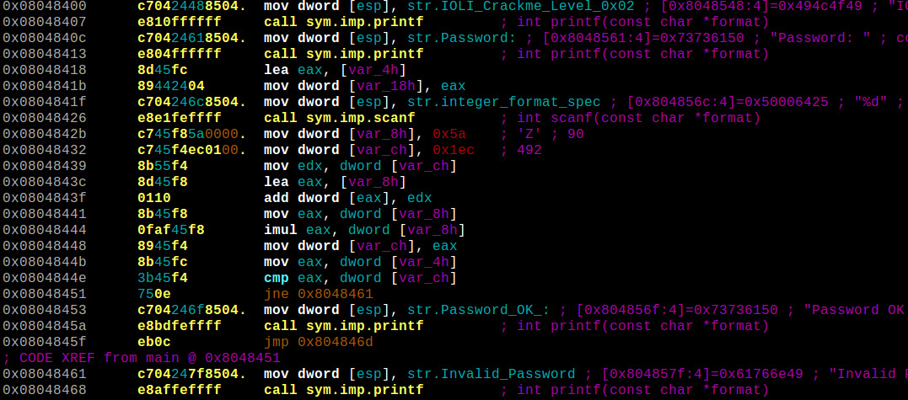

# Background
This is a collection of scripts to solve the password for a simple crackme **IOLI Crackme 0x02** from [GitHub/Maijin/Workshop2015/IOLI-crackme](https://github.com/Maijin/Workshop2015/tree/master/IOLI-crackme). 

As there are Linux (x86), Windows (x86) and PocketPC (ARM) versions of the same crackme, this is a great excuse to try out different tools :wink: and build a personal reference for automating similar RE tasks in the future.

# Static Disassembly

The important bits of the crackme are shown below.

## Linux

The entered password is read via *scanf()* and stored in **Var_4h** as an integer at *0x8048426*. It must match the value in **eax** at *0x08048448* which is calculated by a few mathematical operations between *0x804842B* and *0x8048444*. The password generation can be solved manually from the disassembly above but what's the fun in that? :grin:

# Methods

1. [Scripted debugging with Radare2 and r2pipe for Linux](r2debug/)

TO BE CONTINUED ...
