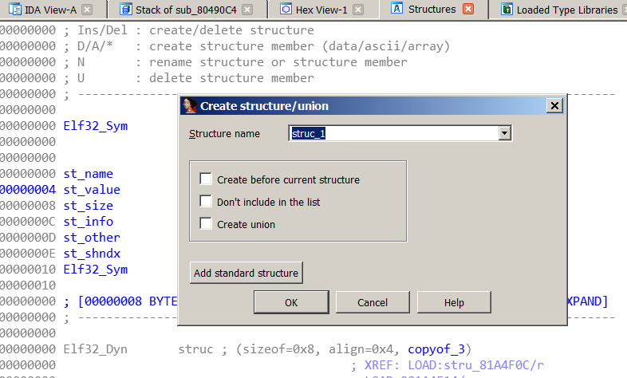
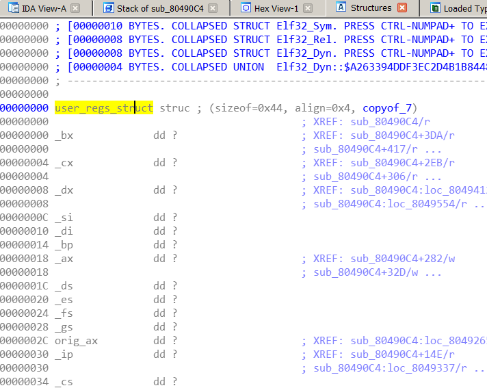
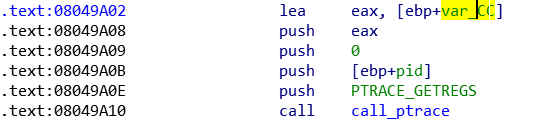
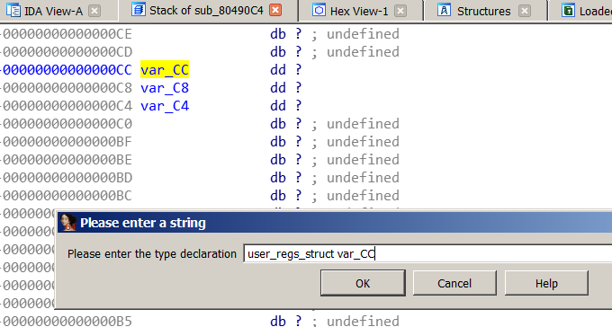
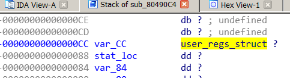
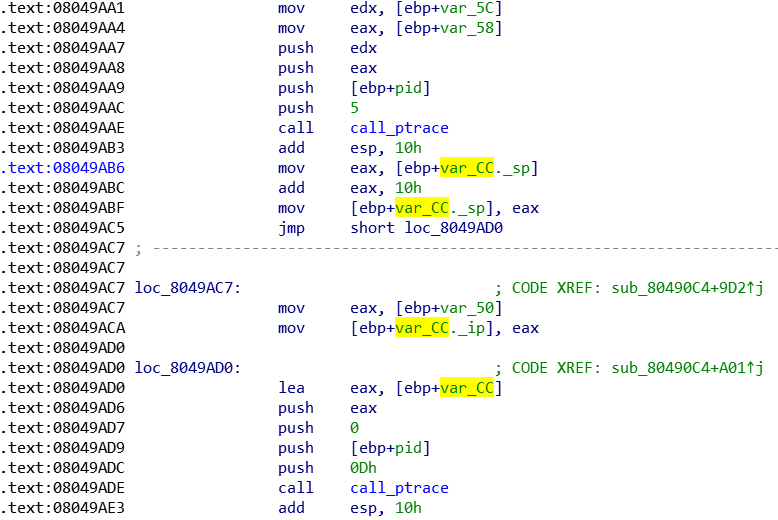

# Introduction

Due to the anti-debugging features of for this binary, anything that can help
for static analysis is useful.

Reading [Linux Journal - Playing with ptrace, Part I](https://www.linuxjournal.com/article/6100)
tells us that calling ptrace with **PTRACE_GETREGS** will write register values into a
variable of `user_regs_struct` type.

I explained to some folks over Twitter that adding this structure helps greatly for
understanding the execution flow statically for this challenge, but I didn't provide
exact instructions, hopefully this bridges the gap.

# Adding structure definition

I'm using IDA Pro Free which does not have the 32 bit version of the struct in the
*gnulnx_x64* type library (or I probably didn't look closely enough) so I look for
the struct definition in [linux/user.h](https://github.com/torvalds/linux/blob/master/arch/x86/include/asm/user_32.h)

```
struct user_regs_struct {
	unsigned long	bx;
	unsigned long	cx;
	unsigned long	dx;
	unsigned long	si;
	unsigned long	di;
	unsigned long	bp;
	unsigned long	ax;
	unsigned long	ds;
	unsigned long	es;
	unsigned long	fs;
	unsigned long	gs;
	unsigned long	orig_ax;
	unsigned long	ip;
	unsigned long	cs;
	unsigned long	flags;
	unsigned long	sp;
	unsigned long	ss;
};
```
Strangely, I found another copy of this struct with e in front of each registers
.e.g. eip instead of ip, but I can't find it now.

Copy it into a text file .e.g. `break.h` and click on `File > Load file > Parse
C header file ...` and select this file.

IDA Pro should display a message indicating "Compilation Successful", as this
struct is fairly simple and doesn't nest other structs inside.

# Adding structure

IDA Pro now has our structure definition but we still have to tell it that we want
to use this structure in our disassembly.

We use `View > Open Subviews > Structures` to open Structures View and press
the `Ins` key to add a new structure and select `Add Standard Structure`.



We select the `user_regs_struct` structure and click OK. The structure should
now be visible in Structures view.



# Setting variable of structure type

At 0x08049A10, we see a call to ptrace with `PTRACE_GETREGS`, hence `var_CC` is
likely to contain the address of our `user_regs_struct` variable.



To define the variable's data type, we can do it as follows (probably there's a
quicker way, but this is the only way that I know, sorry)

Double-click on `var_CC` so that the `Stack of function` tab appears, click on
`var_CC` and type `y` (or right click it and `Set type ...`) and enter
`user_regs_struct var_CC` (now would be a good time to rename it to a
meaningful name like *var_registers*)



IDA Pro should show this after you have successfully changed the type.



And when you browse the function disassembly, all structure offsets will be
automatically detected.



Hmm, someone's updating the EIP before a ptrace call at 08049ACA ;)
