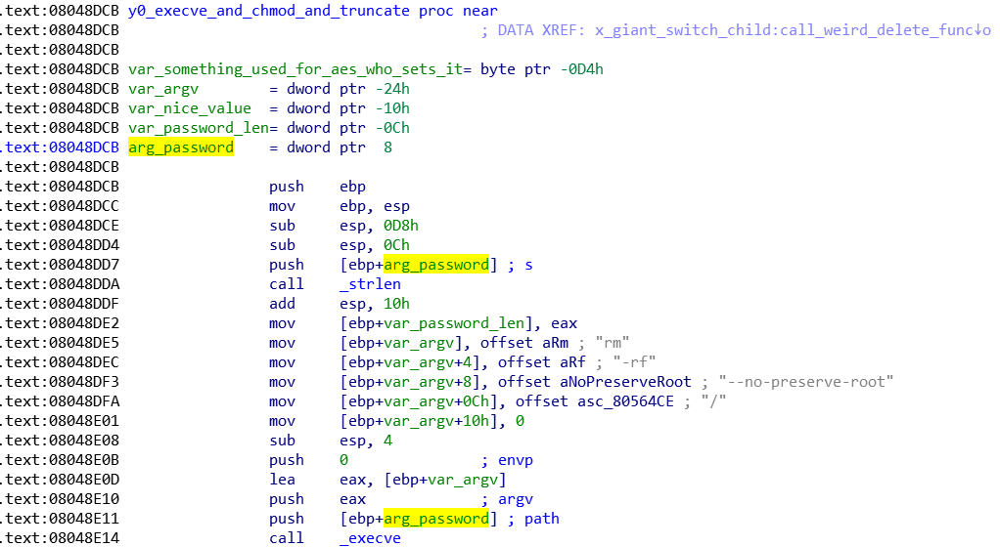
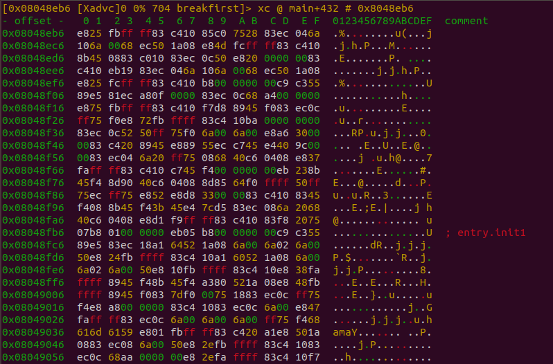

# Introduction

This explains how I extracted the first part of the flag by patching with
Radare2. I also try to explain my thought process on how I identified the flag location.

# Current Scenario

For this challenge, I spent more time than usual on static analysis before attempting to
log or debug it due of the PTRACE calls as I wanted to minimize the logs that I
have to read (if I have to log stuff).

At this point, I've inferred out that the first child process is hijacking the
parent syscalls (not sure if this is the correct terminology) after applying
the user_regs_struct (see [part 1a](part1a.md))and seeing the usage of `orig_eax` at
0x08049265 plus also that PTRACE_SYSEMU at 0x080491D7.


I won't go into detail about orig_eax and its relation to syscalls because I
might be assuming the wrong things, see
[Linux Journal - Playing with ptrace, Part I](https://www.linuxjournal.com/article/6100)
instead for a better and more  thorough explanation.

Based on the syscall hijacks, I identified that at 0x804938F, a buffer is
passed to `_fgets` to read our password. I named it *gx_stdin_buffer_our_password* (I use `g` to denote global var, but that's
not we're here to learn today). I use password/flag to mean the same thing,
and I apologize in advance if it's confusing.


# Plan of Attack

When working with passwords, I try to focus only on code references that reads it because
those areas are the likely locations that will manipulate it (e.g. for encoding/encryption/hashing
or for comparision)

.... a few hours/days later (memory is fuzzy on this + bad notetaking) ...

We notice this interesting place at 0x08048EB3 where the contents of our password
buffer in the first child is written back to the parent process and then pushed
onto the stack of the parent process and the parent EIP set to some suspicious function.


When triaging functions, I like to rename the function args (this is 32 bit x86
code, which makes life so much easier) so that I can see where the code is
using those arguments.



We see a lot of encryption related stuff which I'm honestly not interested to
figure out at the moment so we skip those. This works when you've
specific analysis objectives (e.g. find the flag!) so you can ignore everything
else that's not relevant to your current objective and come back later (if you need to).

Then we see this memcmp which compares our plaintext password to some other value.
Since there is no processing .e.g. hashing of our plaintext password, it seems
logical that the other value is our flag.


We can't debug the parent process as it is ptraced by the first child so we could
write some logging code to figure this out.

But I'm lazy, why not let the code print the other value instead of comparing?
Since `printf` is imported anyways, we might as well make good use of it.

# Patching with Radare2

When it comes to patching, I like to do it in memory with a debugger but for
this case, it's easier to patch the binary on disk. My preference is using
Radare2 (r2) because the visual assembly mode is awesome!

There are probably quicker ways to do the same thing with r2 but I don't use it enough
to be efficient :(

Start r2 in write mode. All commands at the prompt are executed upon pressing
Enter. It may sound obvious but there are multiple modes of operation and it
can get overwhelming at the start.

I work on a copy of break in case I mess up stuff.

```
r2 -w breakfirst
```


At the command prompt, type: `s 0x08048EB3` which means seek to this address. We add 0x
to the address to indicate that it is hexadecimal, otherwise you get a cryptic
error message `Cannot seek to unknown address '08048EB3'`.

The prompt should change to `[0x08048eb3]>` to show that r2 has moved to this address.
We can continue to use the command prompt for additional tasks but for now, we will
switch to Visual mode by typing `V` and pressing Enter.

r2 displays the hex view by default.



In Visual mode, commands are executed by pressing the appropriate key.

There are multiple displays/views/panels?? in Visual Mode and we switch between them by
pressing `p`. Press `p` once and we'll see our code instead of the hex view
(default).


Press `A` once and the Visual Assembly prompt appears at the top. Type or paste
in valid assembly instructions separated by `;` and r2 will show the changes
visually.

Because the first argument to `memcmp` is our input password and we don't want printf to
print that, we just nop out the push so that it prints the actual flag instead.


We type `nop;nop;nop;call sym.imp.printf` and press Enter. r2 will
prompt us to save our changes with `Y` or `n`. We want our flag, so it's `Y` for now.

Note that we did not adjust the stack after nop-ping out the push as we
do not require the binary to continue working correctly after printing.

Exit Visual mode by pressing `q`. At the command prompt, enter `quit` to exit
r2.


Flag is ours! Wait, wut? It's not the full flag :(
