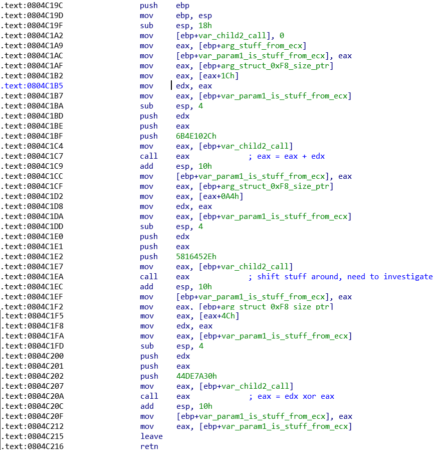

# Introduction

This explains how I did more patching (see
[part 1b](part1b.md#patching-with-radare2) for the basics) to get enough data to
implement the crypto for the second part of the flag.

Patching is not the most efficient technique for this part, as I learnt later from
other folks that you could debug the second child since it was not ptraced by
other processes.

This is going to be light on how I identified the relevant parts of the code
because the underlying strategy is the same as part 1b i.e follow the buffer that
contains our password and ignore everything else.

# Current Scenario

At this point, we followed the buffer containing the next 32 bytes of our
password/flag around and noticed it being passed in parts to the `chmod` library call.


We already know that syscalls are being hijacked/intercepted and looking at the
relevant code for the chmod hijacking code in the first child1, we see that some
manipulation is done to our input password at function 0x804c19c. I think this
is known as a *round* function for symmetric crypto (might have got that term
wrong) Also based on the comments in the disassembly below, I'm pretty bad at
crypto too :P



If we can print out the values at the start and end of this function,
together with other useful values, we could use those values to write the
decryption algorithm in another language.

For this function, we want to print out edx which are the input parameters
for the three functions called at 0x0804C1C7, 0x0804C1EA, 0x0804C20A. We also want
the initial value of `ebp+0C` (named *var_param1_is_stuff_from_ecx* in the disassembly)
when it enters this function and its final value at 0x0804C20F.

# Patching Extra Code

There isn't enough code to patch in so much code at the end of the function, so we
could jump to some other unused code, do our printing and then jump back to
return back to the caller. We just have to ensure that the area that we are
jumping to has execute permissions (which is not a problem because there is so
much unused code and data in this binary :D)

I chose 0x0804B105 for the location of our new printing code.

We also need a place to store our format specifier string, I chose 0x81A51AF to
store the string "chmod= %x %x %x %x %x\n".

# Writing ASM Code

Our ASM code that we want to patch as follows:

At 0x0804C20F, we add a jump to our new code.

```nasm
jmp 0x0804B105
; For aesthetics, since this is never reached
nop
```

At 0x0804B105, we save all registers, print the values we want, restore all
registers and execute any instructions that we overwrite and jmp back to
continue execution.

```nasm
; push and save all registers
pushad
; print the final value of [ebp+0xc]
push eax
; print the structure offsets that are used by the sub functions in 0x804c19c
mov eax, dword [ebp+8]
push dword [eax+0x4c]
push dword [eax+0xA4]
push dword [eax+0x1c]
; print the original value of [ebp+0xc]
push dword [ebp+0xc]
; this will be our format specifier for printf
push 0x81A51AF
call sym.imp.printf
; adjust the stack
add esp, 24
; pop and restore all registers
popad
; Replace the code that we overwrote with the original jump
mov dword [ebp-0xc], eax
mov eax, dword [ebp-0xc]
; Jump back to the original code
jmp 0x0804C215
```

# Patching with r2

To avoid repetition, please refer to [part 1b](part1b.md#patching-with-radare2) for
the basics of patching with r2 as it has more details on r2 usage.

We work on a copy of the binary in write mode, `r2 -w break_print_chmod`.

At the command prompt, type `s 0x0804C20F` and Enter to go to that offset. Switch to
Visual mode by entering `V` and Enter and press `p` once in Visual mode to
switch to the code view/panel.


Press `A` to display the Visual Assembler, type or paste `jmp 0x0804B105;nop` and
press Enter and then `Y` to save the patch.


Press `:` to bring up the command prompt and type `s 0x0804B105` and press
Enter to seek to the offset, `Enter` again to close the command prompt and
return to Visual mode so that we can start our next patch.

Copying and pasting ASM using the Visual Assembler is very useful to test quick
patches. I think that r2 has a limit to the amount of code that can assembled
at once, so I pasted it in two batches (scroll to 0x804b123 and press A again
to activate Visual Assembler to paste the second batch)

`pushad; push eax; mov eax, dword [ebp+8]; push dword [eax+0x4c]; push dword [eax+0xA4]; push dword [eax+0x1c]; push dword [ebp+0xc]; push 0x81A51AF; call sym.imp.printf;`

`add esp, 24;popad; mov dword [ebp-0xc], eax; mov eax, dword [ebp-0xc]; jmp 0x0804C215`


We want to also add a format specifier for our printf at 0x81A51AF using the write zero terminated string command `wz`.

`wz chmod= %x %x %x %x %x\n @ 0x81A51AF`

Running the binary prints all the necessary values to implement the crypto in
Python or another language.


