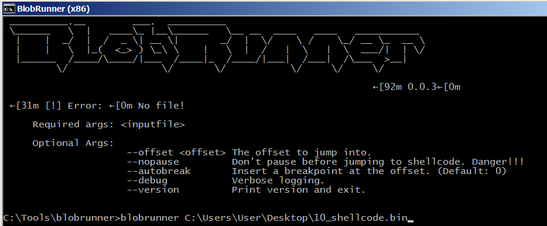
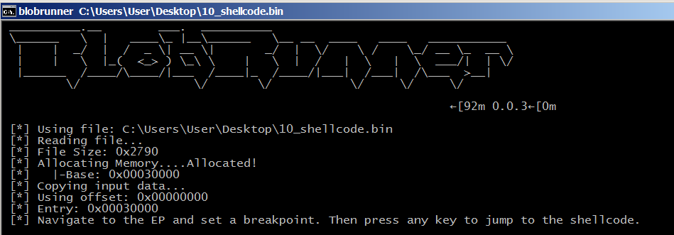
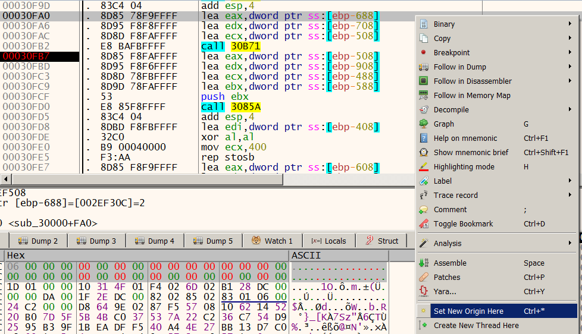
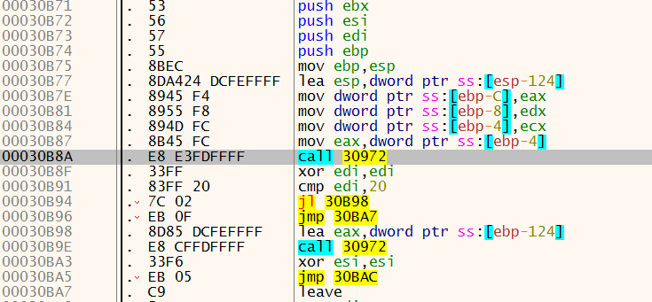
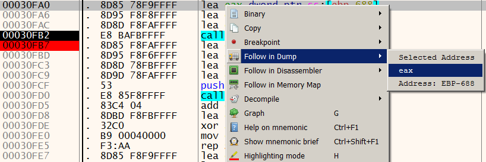
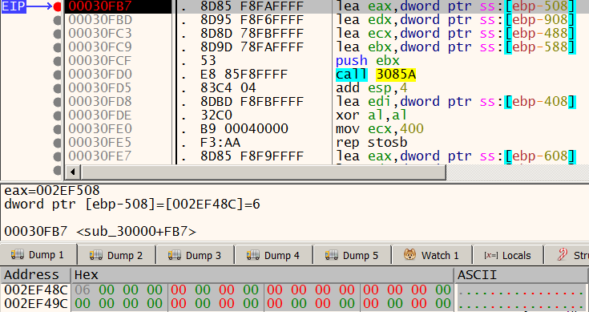

# Introduction

For part 3 of the flag, I extracted it from the 40000 bytes buffer but couldn't
figure out how it was executed or how to debug it. Later I got help
from folks on debugging this, but that's another story :)

After analyzing this statically for a while and discussing with other folks
about the possiblity of some of the functions performing mathematical
operations on big numbers, I got an idea to test out parts of the shellcode to
validate this hypothesis using x64dbg on Windows. I probably should have done this
using gdb combined with the awesome [gef](https://github.com/hugsy/gef) but I'm
just more proficient with x64dbg :(

# WARNING!

I didn't continue the approach after I learnt how to debug into the shellcode
(thanks to [@_fevral_](https://twitter.com/_fevral_)) as this is a super hacky
and inefficient technique. Still I'm documenting this as it may have its uses.

# Assumptions

I assumed that this approach worked for the code that I was testing because it
contained no Linux-specific syscalls or library functions. x86 ASM runs the same in
Windows or Linux (ABI might differ but that doesn't affect the proper execution at
the assembly level).

Also I assumed that any mathematical operations would work with small numbers
as well as big numbers. It's hard to visually check the output and determine
mathematical operations when the numbers are 32 bytes long, but we can feed
these functions single byte values to test.

Also because of the assumption that we were working on big numbers, we can
infer some of the operations based on the number of function arguments. These
numbers are too large to be stored in the general registers so some of the
arguments must be pointing to destination buffers. There is always the possibility
of a function overwriting a input buffer with the result, so we have to be careful.

# Debugging

I used [OALabs's BlobRunner](https://github.com/OALabs/BlobRunner) to load the
shellcode. In this case, BlobRunner has mapped it to 0x30000, so to compute our
VA for the respective address, we add 0x30000 to the RVA shown in our
disassembly (or rebase it in IDA Pro via `Edit > Segments > Rebase Program ...`)

After attaching to BlobRunner in x32dbg and setting a breakpoint at 0x30000, I pressed
Enter in the BlobRunner window and wait for the breakpoint to hit.

I redirected execution to 0x30FAO by navigating there with `Ctrl+G`, right-click on selecting the address
and clicking `Set New Origin Here`. We want to test that function called at
0x30FB2 because we think it's a multiplication function.

We take a quick look inside the function at 0x307B1. The function at 0x30792 was
identified via static analysis as some sort of a clear buffer or initializtion
function, so from this we can infer that ecx is likely to be a destination argument.

When execution reaches 0x30FB2, we proceed to first fill the first 32 bytes at
the addresses pointed by eax and edx with 0 (select 32 bytes, right click and
select `Binary > Fill ...` and enter 00 to clear all bytes to 0)

Modify just the first byte to our test values. I used 0x02 and 0x03 for the buffers
pointed by eax and edx.

We fill the 32 bytes at address pointed by ecx with 0 (although it's strictly not
necessary since the code will clear them anyway)

Set a breakpoint at 0x30FB7 and check the value at the address pointed by ecx when the
breakpoint hits. It should show 0x06 which likely means that this function does
multiplication (although we should always test with more than one set of test
values)

To repeat our test, we use the Set Origin Here to reset the EIP back to
0x30FA0 or set to another EIP to test another function.
