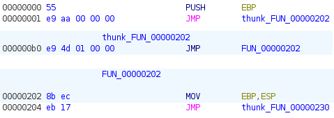
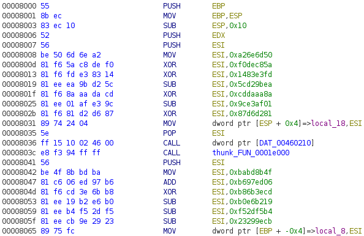
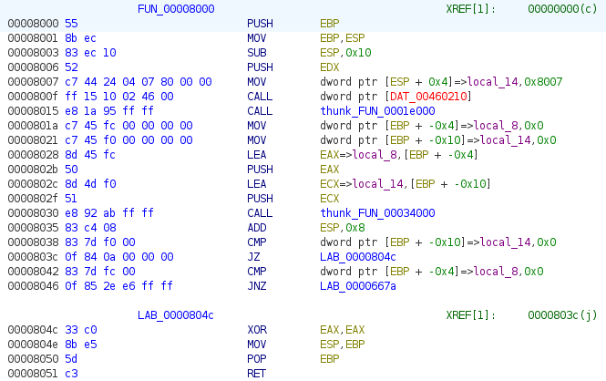

The first layer of shellcode executed by the EXE uses a JMP-based obfuscation that
looks similar to Challenge 13 to hinder static code analysis. I don't remember
analyzing this shellcode statically hence I didn't think of reconstructing the
code.

After writing the diassembler script to reconstruct the code for Challenge 13,
I made a few changes to allow it to handle a x86 binary blob, .e.g. extending
the binary blob instead of adding a new section as for a PE file. See
[patch_shellcode.py](patch_shellcode.py).

The final result is a (slightly!) more readable disassembly but needs further work
using a emulator like Unicorn to replace the ADD, SUB and XOR-obfuscated register
values with their literal values.

A work-in-progress script that rewrites and removes the register obfuscation
in most locations can be found at [patch_deobfs_wip.py](patch_deobfs_wip.py).

Please refer to the [Challenge 13 README](../ch13/README.md) for more details on
the implementation for reconstructing the code.
