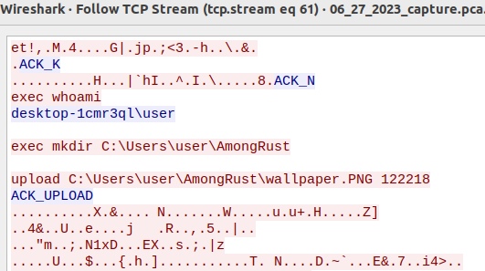

To communicate with the C2 server listening at port 8345, this was the manual
process I followed:
1. Observed in WireShark that there's TCP traffic between 192.168.213:51885 and
   192.168.189.128:8345 (our C2 server), filter with `ip.addr==192.168.189.213 && ip.addr==192.168.189.128`
2. Followed and saved the TCP stream as raw bytes
3. Extracted the individual requests with a Python script or by hand with a hex editor
   :grimacing:
4. Wrote a Python script to send each request and listen for a response that
   matches what was observed in the PCAP before sending the next request

This looks like a good opportunity to fully automate the extraction and replay of
the C2 requests!

## TL;DR
This is a pair of simple scripts that extracts (`extract_reqs.py`) and replay
(`replay_reqs.py`) the TCP requests to a C2 server.

- `python extract_reqs.py 06_27_2023_capture.pcapng 192.168.189.213:51885 192.168.189.128:8345`
extracts all requests from src IP `192.168.189.213:51885` to C2 server at `192.168.189.128:8345`
- Review the list of requests and responses generated and delete pairs of `req_*_client.bin` and
`req_*_server.bin` that we don't need .e.g. the request to get the user name via
`whoami` (`req_0005_client.bin` and `req_0006_server.bin`)
- Start the C2 server/listener
- Run `python replay.reqs.py` while C2 is running to replay generated requests.

## Implementation

### extract_reqs.py
Extracts requests and responses to and from a C2 server from a PCAP. Each request or
response is written to a separate binary file and numbered in the same order as they
appear in the TCP stream.
- For this TCP conversation, it starts with a request to the C2. This is saved as
`req_0001_client.bin` and the corresponding server response is saved as
`req_0002_server.bin`. The next request is saved as `req_0003_client.bin` and so forth.
- This is the automated equivalent of steps 1 to 3 above.

### replay_reqs.py
Replays the traffic by connecting to the C2 server and sending the same requests
and receiving responses in the same order as in the PCAP. This is the
equivalent of step 4 above.

This just iterates through the list of request and response files sorted by the
filename in ascending order. It attempts to send the request if it has `client` in
the filename and expects to receive a response of the same length if it has
`server` in the filename. The script logs any server response that doesn't match the
value in the PCAP.

## Tools/Libraries used
- [scapy](https://scapy.net/): Parse and extract TCP payloads from PCAP
