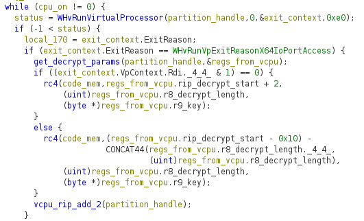

There are two interesting parts to this challenge.

- Finding the start of the x64 instructions in the code blob passed to Hyper-V
virtual processor
- Patching the decrypted code back into the code blob to enable static code
  analysis

## Finding start of x64 code

For this challenge, we are really interested in finding the x64 assembly
inside the code blob because we can assume that the important logic is running as
64 bit code, due to the EXE code reading `rip`, `r8` and `r9` from the
`WHV_RUN_VP_EXIT_CONTEXT` struct after executing `WHvRunVirtualProcessor`.

Due to my limited understanding of how the virtual processor works, I
tried disassembling the first byte with a x86 (64 bit) processor in Ghidra which
gave very weird results. As the initial `rip` value of the virtual processor
context is 0, I concluded that the code starts at byte 0 but with a different
bitness.

I made copies of the file and tested x86 Real Mode (16 bit), x86 Protected Mode
(16 bit) and x86 (32 bit) and finally found the 64 bit code starting at `0xcf2` via
trial and error.

This switches from Real Mode to Protected Mode.

Function starting from 0x0037 is for switching to Long Mode. The jump to 64 bit
code is at 0x0030.

I wrote `dis_hyperv.py` to take advantage of Capstone's ability to switch processor
modes to handle this scenario. The code is more of an learning exercise to
understand how to check for the switch from 16 bit Real Mode to 32 bit Protected
Mode and to 64 bit Long Mode. It doesn't follow calls and jumps correctly but
sufficient to find where the Long Mode switch is in this sample (lucky
concidence due to the long jumps redirecting to code directly after each jump).

OSDev Wiki has a couple of very good references for switching to
[Protected Mode](https://wiki.osdev.org/Protected_Mode) and
[Long Mode](https://wiki.osdev.org/Setting_Up_Long_Mode).

## Patch dynamically decrypted code for static analysis

The code blob uses `in` and `out` instructions to communicate with the EXE to
decrypt and re-encrypt code on the fly (potentially as an anti-memory dump feature).

The approach I used during the challenge was to edit a breakpoint in x64dbg to
log the `rip`, `r8` (RC4 key), `r9` (encrypted code length) values by setting
`Offset={rdx}, Length={r8}, Key={bswap;8@r9}` in **Log Text** and `g` (just log
and continue without breaking into the debugger) in **Command Text**. I then wrote
a Python script `patch_code.py` to patch in the bytes for static code analysis.

I wrote `emu_patch_code.py` after the challenge to directly emulate the code blob
with Unicorn and hook the `in` and `out` instructions and perform the same
patching. I took the easy way out and restarted the emulator after patching
each call to the code decryptor until no more calls to the code decryptor were
observed. An alternative approach could be to patch the code region dynamically
using Unicorn's `mem_write` calls within the emulator and resetting the `rip`.

Comparing the two approaches, I prefer the emulation approach better as it's
more automated (no manual transfer of addresses and key bytes from x64dbg logs
into Python script). Note that the emulator is limited to patching areas of the
code it can reach unless we redirect it to those areas or provide the necessary
input args so the execution reaches the areas that we want. As of now, the code
is sufficiently decrypted for manually patching the remaining undecrypted areas.

## Tools/Libraries used
- [capstone](https://www.capstone-engine.org/lang_python.html): Disassembly
- [malduck](https://malduck.readthedocs.io/en/latest/): RC4 decryption
- [unicorn](https://www.unicorn-engine.org/docs/tutorial.html): CPU emulation
