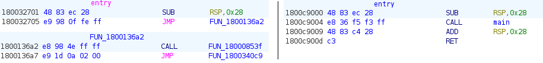
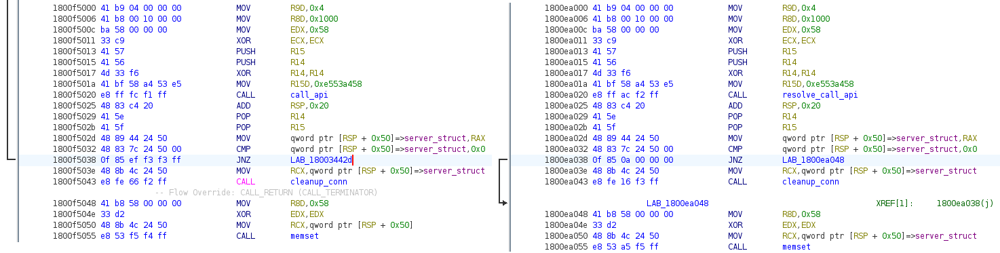
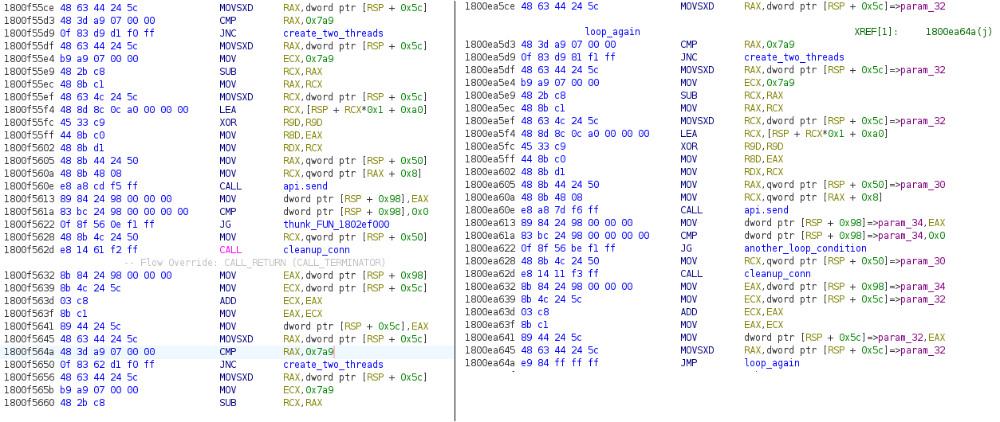

This binary for this challenge presented a very interesting programming problem to
reconstruct the binary into to a saner state for static code analysis.

## TL;DR

Run `dis_patch.py` to generate a copy of the binary with `.patched`
extension containing the rebuilt code. All non-duplicated functions are patched
into thunks to the deobfuscated code in the new code region. Loops and conditional
jumps are also fixed to point back into the containing functions.

**NOTE:** As the fixes for conditional jumps and loops were only added after completing
challenge, I did not verify the fixes for all the functions.

## Obfuscation Techniques

There are three techniques used, although the latter two are only obvious after
the first jump-based obfuscation has been removed.

1. Obfuscation of control flow with unconditional jumps
2. Unrolled loops that increase the number of duplicate instructions
3. Conditional jumps to partial copies of the containing functions

After removing the jump-based obfuscation, the next problem encountered is that
patching the reconstructed functions in place causes some of the functions
disassembled later to overwrite previously reconstructed functions in their vicinity.

A few of the functions are just very long due to the use of stack strings, but
others are long due to unrolled loops. Unrolled loops is similar to copy-pasting
the same code `n` times instead of using a loop to iterate `n` times.

Due to the length of some of the unrolled loops, they cause the containing
functions to trample over other functions. I worked around this by setting a limit
on the max instructions per function, as well as creating a new code section to
contain the reconstructed function bytes. By having each function jump to its
own allocated area within that code section, this solves the issue of functions
overwriting each others. Having a max instruction limit per function works, but
it still generates a lot of unnecessary code references due to the unrolled loops.

This inelegant fix is sufficient to perform static analysis to complete the
challenge as the unrolled loops can be visually recognized and ignored.

Now that all code is fully disassembled and recovered, the third
obfuscation technique can be seen. Calls within functions usually jump to a
completely different code (like how functions are typically used to modularize
srouce code). However, conditional jumps usually jump to a partial copy of the
containing function (usually a few instructions above or below the jump instruction
within the same function). Of course, there are exceptions where the conditional
jumps behave like function calls to complicate matters :grimacing: .

During the challenge, I manually labelled these jumps by visually comparing the
code in the current function vs the jump destination.

## Implementation
The updated `dis_patch.py` handles all 3 obfuscation techniques using simple
pattern matching techniques. There were multiple unsuccessful iterations before this
final implementation and they are documented under the **What Didn't Work** section
below.

### Unconditional Jumps

This is the easiest to fix.

- Start disassembly at first instruction in function.
    - If it's a `jmp`  instruction with a memory address, continue to disassemble
the code at the jump destination and discard the `jmp` instruction.
    - If not, fix up the relative offset (for `call`, `lea` and `jxx`
      conditional jumps) and save the instruction bytes.
- Repeat until we hit the max instruction limit or the end of the function e.g.
  `ret` or `jmp rax`.
- Process the conditional jump and call destinations for current function.
- Fix up conditional jump destinations if possible (next section).
- Patch the fixed function instruction bytes into a copy of the binary.
- Return call destinations for further processing.

Fixing unconditional jumps: before (left) and after (right)

### Conditional Jumps

I fixed the conditional jumps next because this had a more obvious solution
than for unrolled loops.

As most of the conditional jumps were to locations within the same function, I
stored the disassembly string for each instruction within the same function.
The rationale for using disassembly string as opposed to instruction bytes was that
comparing instructions with relative offsets (e.g. conditional jumps and calls)
was easier.

I disassembled the first 10 instructions for the jump destination and tried
comparing these 10 instructions to anywhere in the function. If a match was
found for all 10 instructions, the jump destination for that conditonal jump was
patched to the matching location. A global dictionary mapping the original jump
destination to the patched location was updated so that other jumps to the same
destination were patched similarly.

If no matches were found, the conditional jump was treated like a `call`
instruction and processed like a function.

Fixing conditional jumps: before (left) and after (right)

### Unrolled Loops

After implementing the conditional jump patching, I realized the same matching
technique could be used to match the test condition for exiting loops. I observed
that `cmp` and `test` instructions were used to check the loop condition, followed
by a conditional jump used for exiting each loop.

I stored the `cmp` and `test` instructions into a separate dictionary during
function reconstruction and upon encountering a previously seen `cmp` or
`test` instruction, I disassembled the next 20 instructions and did the same
disassembly string compare with the 20 instructions following the previous
comparison instruction.

If it matched, I patched the current instruction to jump back to the previous
comparison and stopped the disassembly for that function.

This is not a perfect replacement as the jump patch causes the conditional
jump matching to not match in some instances (slightly increases the amount of
duplicate code in the reconstructed version).

Fixing unrolled loops: before (left) and after (right)

## Limitations
- Code is written to a new code section, using a hardcoded size calculated by
number of expected functions * a hardcoded size for each function in bytes. A
dynamically expanded section would be nice but the current approach is sufficient
for this sample.
- Original virtual address of each instruction is lost so setting breakpoints in the
debugger was a pain. I could have generated a mapping of the original virtual
address from Capstone with the new patched virtual address but didn't implement it.

## What Didn't Work
- Fixing the control flow via emulation with Unicorn. Unicorn doesn't handle
Windows-specific detail e.g. reading the PEB (not a fault of Unicorn itself),
so I opted to use Capstone instead.
- Manually patching the conditional jumps and unrolled loops. There was one interim
version where I added a dictionary of virtual addresses to patch together with
the correct destinations based on manual analysis in Ghidra. This was an
unsustainable approach once I discovered the number of unique functions was
more than 10.

## Other Notes
- Patching out the original obfuscated functions with `0xc3` rets was to remove
all the annoying code references and prevent Ghidra from detecting them as code.
- I don't have enough samples to determine if the current script is generic enough
for similiar samples but it was interesting to note that modifying the script to
handle a binary blob worked for disassembling the shellcode for [challenge 05](../ch05).
 It didn't help much for static analysis in the end since the register values were
additionally obfuscated with XOR and arithmetic instructions.

## Tools
- [capstone](https://www.capstone-engine.org/lang_python.html): Disassembly
- [lief](https://github.com/lief-project/LIEF): Writing a new code section to
  PE
- [pefile](https://github.com/erocarrera/pefile): Parsing PE header
